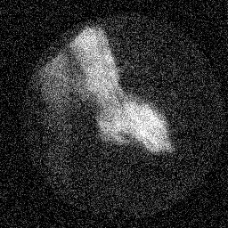
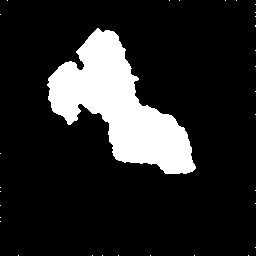
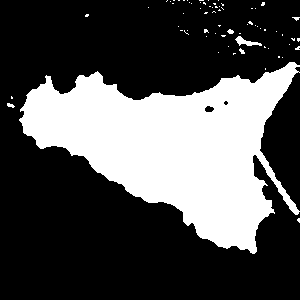
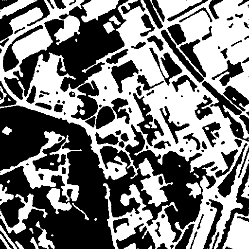

# Segmentation based on Markov with Simulated Annealing Algorithm

1. Compile c code: ```./compilegcc SegmentationWithSimulatedAnnealing``` 
2. Run executable file: ```./SegmentationWithSimulatedAnnealing your_input_image```
3. Output 2 images: original image, segmentation image
4. Results
<br>


<br>


<br>



